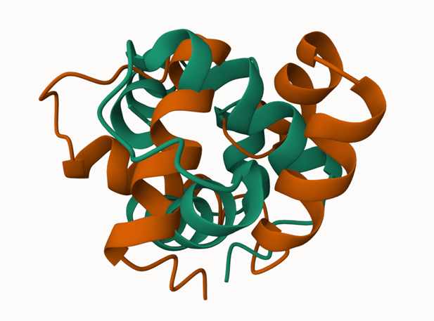
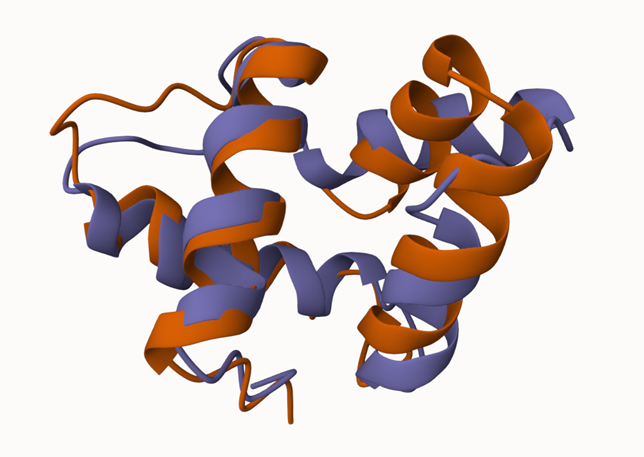

# TM-score-python
Python implementation of the [TM-score](https://zhanggroup.org/TM-score/).

<div style="display:flex; align-items:center;">


</div>

*before superposition(left), after superposition(right)*

## Getting Started
### Dependencies and requirements
```
pip install numpy
```

### Usage
```
python tm_score.py --template_path A572547.pdb --native_path B572547.pdb
```

### Results
Return global RMSD, TM-score, RMSD when get the best TM-score, rotation_matrix, translation vector and pdb file of template structure after superposition.  
```
---------- Results ----------
RMSD: 3.322734531560978
Best TM-score: 0.6442516336943744
Final RMSD: 3.4550969885522664
Best Rotation Matrix:
 [[ 0.74706103 -0.08476711  0.65932871]
 [ 0.63417725 -0.2064761  -0.7451086 ]
 [ 0.19929632  0.97477287 -0.10049288]]
Best Translation Vector:
 [-23.6888463   12.48918027  45.8859844 ]
-----------------------------
Rotated coordinates saved to A572547_superpos.pdb.
```